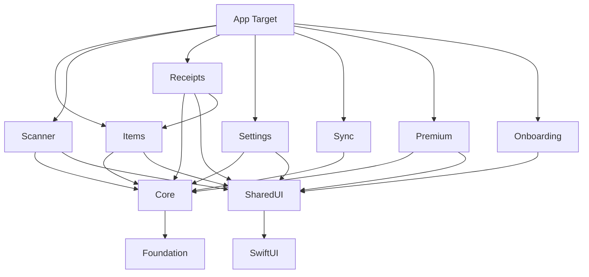

# HomeInventory Modular Rebuild Guide

## Table of Contents
1. [Overview](#overview)
2. [Core Principles](#core-principles)
3. [Module Architecture](#module-architecture)
4. [Implementation Strategy](#implementation-strategy)
5. [Step-by-Step Migration](#step-by-step-migration)
6. [Package Definitions](#package-definitions)
7. [Feature Toggle System](#feature-toggle-system)
8. [Error Handling & Fallbacks](#error-handling-fallbacks)
9. [CI/CD Integration](#cicd-integration)
10. [Testing Strategy](#testing-strategy)
11. [Troubleshooting](#troubleshooting)

## Overview

This guide outlines a complete restructuring of the HomeInventory app into a modular, always-buildable architecture. The goal is to maintain existing functionality while enabling progressive development where the app always compiles and runs, even with incomplete features.

### Why Modularize?

- **Always Buildable**: Main branch never breaks
- **Isolated Development**: Work on features without affecting others
- **Faster Builds**: Only rebuild changed modules
- **Better Testing**: Test features in isolation
- **Team Scalability**: Multiple developers can work without conflicts
- **Progressive Enhancement**: Add features incrementally

## Core Principles

### 1. The Green Trunk Rule
- Main branch ALWAYS builds and runs
- Every commit passes all tests
- Broken features show fallback UI, not crashes
- Deploy/demo at any moment

### 2. Module Independence
- Each feature is a self-contained Swift Package
- Clear API boundaries between modules
- Modules depend only on Core/Shared, not each other
- Mock implementations for testing

### 3. Progressive Integration
- Start with minimal "Hello World" app
- Add one module at a time
- Verify build after each addition
- Use feature flags for incomplete work

### 4. Fail Gracefully
- Never crash due to missing features
- Show "Coming Soon" or error states
- Log issues for debugging
- Maintain user trust

## Module Architecture

### High-Level Structure

```
HomeInventory/
├── App/                          # Main app target (thin layer)
│   ├── HomeInventoryApp.swift
│   ├── ContentView.swift
│   ├── AppCoordinator.swift
│   └── Configuration/
├── Modules/                      # Feature modules (Swift Packages)
│   ├── Core/                     # Business logic, models, protocols
│   ├── SharedUI/                 # Design system, common UI
│   ├── Items/                    # Item management feature
│   ├── Scanner/                  # Barcode/document scanning
│   ├── Receipts/                 # Receipt processing
│   ├── Settings/                 # App settings
│   ├── Sync/                     # Data synchronization
│   ├── Premium/                  # Premium features
│   ├── Onboarding/              # First-run experience
│   └── Analytics/               # Analytics & tracking
├── Tests/                        # Integration tests
└── CI/                          # Build scripts
```

### Module Dependencies



### Module Responsibilities

#### Core Module
- Data models & DTOs
- Business logic protocols
- Repository interfaces
- Service protocols
- Error types
- Constants & configuration

#### SharedUI Module
- Design system (colors, fonts, spacing)
- Common UI components
- Theme management
- Accessibility helpers
- UI extensions
- Animation utilities

#### Feature Modules
Each feature module contains:
- Public API (protocols/interfaces)
- View models
- Views
- Internal implementation
- Feature-specific models
- Unit tests

## Implementation Strategy

### Phase 1: Foundation (Week 1)
1. Create workspace structure
2. Set up Core and SharedUI packages
3. Create minimal app shell
4. Implement feature toggle system
5. Set up CI pipeline

### Phase 2: Core Features (Week 2-3)
1. Migrate Items module
2. Migrate Scanner module
3. Migrate Settings module
4. Verify each builds independently

### Phase 3: Advanced Features (Week 4-5)
1. Migrate Receipts module
2. Migrate Sync module
3. Migrate Premium module
4. Add integration tests

### Phase 4: Polish (Week 6)
1. Migrate Onboarding
2. Add analytics
3. Performance optimization
4. Documentation

## Step-by-Step Migration

### Step 1: Prepare the Codebase

```bash
# Create feature branch
git checkout -b feature/modular-architecture

# Create new directory structure
mkdir -p HomeInventory/Modules
mkdir -p HomeInventory/Modules/Core
mkdir -p HomeInventory/Modules/SharedUI
mkdir -p HomeInventory/CI
```

### Step 2: Create Core Module

```swift
// Modules/Core/Package.swift
// swift-tools-version: 5.9
import PackageDescription

let package = Package(
    name: "Core",
    platforms: [.iOS(.v17)],
    products: [
        .library(
            name: "Core",
            targets: ["Core"]
        ),
    ],
    targets: [
        .target(
            name: "Core",
            dependencies: [],
            path: "Sources"
        ),
        .testTarget(
            name: "CoreTests",
            dependencies: ["Core"],
            path: "Tests"
        ),
    ]
)
```

Move to Core:
- Models (Item, Receipt, Category, Location)
- Protocols (Repository, Service interfaces)
- Error types
- Constants
- DTOs

### Step 3: Create SharedUI Module

```swift
// Modules/SharedUI/Package.swift
// swift-tools-version: 5.9
import PackageDescription

let package = Package(
    name: "SharedUI",
    platforms: [.iOS(.v17)],
    products: [
        .library(
            name: "SharedUI",
            targets: ["SharedUI"]
        ),
    ],
    dependencies: [
        .package(path: "../Core")
    ],
    targets: [
        .target(
            name: "SharedUI",
            dependencies: ["Core"],
            path: "Sources",
            resources: [
                .process("Resources")
            ]
        ),
        .testTarget(
            name: "SharedUITests",
            dependencies: ["SharedUI"],
            path: "Tests"
        ),
    ]
)
```

Move to SharedUI:
- Design system components
- Theme management
- Common views
- UI extensions
- Accessibility utilities

### Step 4: Create Items Module

```swift
// Modules/Items/Package.swift
// swift-tools-version: 5.9
import PackageDescription

let package = Package(
    name: "Items",
    platforms: [.iOS(.v17)],
    products: [
        .library(
            name: "Items",
            targets: ["Items"]
        ),
    ],
    dependencies: [
        .package(path: "../Core"),
        .package(path: "../SharedUI")
    ],
    targets: [
        .target(
            name: "Items",
            dependencies: ["Core", "SharedUI"],
            path: "Sources"
        ),
        .testTarget(
            name: "ItemsTests",
            dependencies: ["Items"],
            path: "Tests"
        ),
    ]
)
```

#### Items Module Structure

```
Modules/Items/
├── Sources/
│   ├── ItemsModule.swift         # Module entry point
│   ├── Public/                   # Public API
│   │   ├── ItemsModuleAPI.swift
│   │   └── ItemsCoordinator.swift
│   ├── Views/
│   │   ├── ItemListView.swift
│   │   ├── ItemDetailView.swift
│   │   └── AddItemView.swift
│   ├── ViewModels/
│   │   ├── ItemListViewModel.swift
│   │   └── ItemDetailViewModel.swift
│   └── Internal/
│       └── ItemRepository.swift
└── Tests/
    ├── ItemListViewModelTests.swift
    └── ItemRepositoryTests.swift
```

#### Items Module API

```swift
// ItemsModuleAPI.swift
import SwiftUI
import Core

public protocol ItemsModuleAPI {
    func makeItemListView() -> AnyView
    func makeItemDetailView(item: Item) -> AnyView
    func makeAddItemView(completion: @escaping (Item) -> Void) -> AnyView
}

public final class ItemsModule: ItemsModuleAPI {
    private let dependencies: ItemsModuleDependencies
    
    public init(dependencies: ItemsModuleDependencies) {
        self.dependencies = dependencies
    }
    
    public func makeItemListView() -> AnyView {
        AnyView(ItemListView(viewModel: makeItemListViewModel()))
    }
    
    public func makeItemDetailView(item: Item) -> AnyView {
        AnyView(ItemDetailView(item: item, viewModel: makeItemDetailViewModel()))
    }
    
    public func makeAddItemView(completion: @escaping (Item) -> Void) -> AnyView {
        AnyView(AddItemView(viewModel: makeAddItemViewModel(), completion: completion))
    }
    
    // Private factory methods
    private func makeItemListViewModel() -> ItemListViewModel {
        ItemListViewModel(
            itemRepository: dependencies.itemRepository,
            analyticsService: dependencies.analyticsService
        )
    }
    
    private func makeItemDetailViewModel() -> ItemDetailViewModel {
        ItemDetailViewModel(
            itemRepository: dependencies.itemRepository,
            imageService: dependencies.imageService
        )
    }
    
    private func makeAddItemViewModel() -> AddItemViewModel {
        AddItemViewModel(
            itemRepository: dependencies.itemRepository,
            barcodeService: dependencies.barcodeService,
            categoryService: dependencies.categoryService
        )
    }
}

// Dependencies container
public struct ItemsModuleDependencies {
    public let itemRepository: ItemRepositoryProtocol
    public let analyticsService: AnalyticsServiceProtocol
    public let imageService: ImageServiceProtocol
    public let barcodeService: BarcodeServiceProtocol
    public let categoryService: CategoryServiceProtocol
    
    public init(
        itemRepository: ItemRepositoryProtocol,
        analyticsService: AnalyticsServiceProtocol,
        imageService: ImageServiceProtocol,
        barcodeService: BarcodeServiceProtocol,
        categoryService: CategoryServiceProtocol
    ) {
        self.itemRepository = itemRepository
        self.analyticsService = analyticsService
        self.imageService = imageService
        self.barcodeService = barcodeService
        self.categoryService = categoryService
    }
}
```

### Step 5: Update Main App

```swift
// App/HomeInventoryApp.swift
import SwiftUI
import Core
import SharedUI
import Items
import Scanner
import Settings

@main
struct HomeInventoryApp: App {
    @StateObject private var appCoordinator = AppCoordinator()
    @StateObject private var featureFlags = FeatureFlagService()
    
    var body: some Scene {
        WindowGroup {
            ContentView()
                .environmentObject(appCoordinator)
                .environmentObject(featureFlags)
                .onAppear {
                    appCoordinator.bootstrap()
                }
        }
    }
}

// App/ContentView.swift
import SwiftUI
import SharedUI

struct ContentView: View {
    @EnvironmentObject var coordinator: AppCoordinator
    @EnvironmentObject var featureFlags: FeatureFlagService
    
    var body: some View {
        TabView {
            // Items tab - always available
            coordinator.itemsModule.makeItemListView()
                .tabItem {
                    Label("Items", systemImage: "square.grid.2x2")
                }
            
            // Scanner tab - check feature flag
            if featureFlags.isEnabled(.scanner) {
                coordinator.scannerModule.makeScannerView()
                    .tabItem {
                        Label("Scan", systemImage: "barcode.viewfinder")
                    }
            } else {
                FeatureUnavailableView(feature: "Scanner")
                    .tabItem {
                        Label("Scan", systemImage: "barcode.viewfinder")
                    }
            }
            
            // Receipts tab - check feature flag
            if featureFlags.isEnabled(.receipts) {
                coordinator.receiptsModule.makeReceiptsView()
                    .tabItem {
                        Label("Receipts", systemImage: "doc.text")
                    }
            }
            
            // Settings tab - always available
            coordinator.settingsModule.makeSettingsView()
                .tabItem {
                    Label("Settings", systemImage: "gear")
                }
        }
        .overlay(alignment: .top) {
            if coordinator.hasErrors {
                ErrorBanner(errors: coordinator.errors)
            }
        }
    }
}
```

### Step 6: App Coordinator

```swift
// App/AppCoordinator.swift
import SwiftUI
import Core
import Items
import Scanner
import Settings
import Receipts

@MainActor
final class AppCoordinator: ObservableObject {
    // Module instances
    private(set) var itemsModule: ItemsModuleAPI!
    private(set) var scannerModule: ScannerModuleAPI!
    private(set) var settingsModule: SettingsModuleAPI!
    private(set) var receiptsModule: ReceiptsModuleAPI!
    
    // Shared services
    private var container: DependencyContainer!
    
    // Error handling
    @Published var errors: [Error] = []
    var hasErrors: Bool { !errors.isEmpty }
    
    func bootstrap() {
        do {
            // Initialize dependency container
            container = try DependencyContainer()
            
            // Initialize modules with error handling
            initializeItemsModule()
            initializeScannerModule()
            initializeSettingsModule()
            initializeReceiptsModule()
            
        } catch {
            errors.append(error)
            print("❌ Bootstrap failed: \(error)")
        }
    }
    
    private func initializeItemsModule() {
        do {
            let dependencies = ItemsModuleDependencies(
                itemRepository: container.itemRepository,
                analyticsService: container.analyticsService,
                imageService: container.imageService,
                barcodeService: container.barcodeService,
                categoryService: container.categoryService
            )
            itemsModule = ItemsModule(dependencies: dependencies)
        } catch {
            print("⚠️ Items module failed to initialize: \(error)")
            itemsModule = MockItemsModule() // Fallback
            errors.append(ModuleError.initializationFailed(module: "Items", error: error))
        }
    }
    
    private func initializeScannerModule() {
        do {
            let dependencies = ScannerModuleDependencies(
                cameraService: container.cameraService,
                barcodeService: container.barcodeService,
                documentService: container.documentService
            )
            scannerModule = ScannerModule(dependencies: dependencies)
        } catch {
            print("⚠️ Scanner module failed to initialize: \(error)")
            scannerModule = MockScannerModule()
            errors.append(ModuleError.initializationFailed(module: "Scanner", error: error))
        }
    }
    
    private func initializeSettingsModule() {
        do {
            let dependencies = SettingsModuleDependencies(
                userDefaultsService: container.userDefaultsService,
                authService: container.authService,
                categoryService: container.categoryService,
                locationService: container.locationService
            )
            settingsModule = SettingsModule(dependencies: dependencies)
        } catch {
            print("⚠️ Settings module failed to initialize: \(error)")
            settingsModule = MockSettingsModule()
            errors.append(ModuleError.initializationFailed(module: "Settings", error: error))
        }
    }
    
    private func initializeReceiptsModule() {
        do {
            let dependencies = ReceiptsModuleDependencies(
                receiptRepository: container.receiptRepository,
                ocrService: container.ocrService,
                emailService: container.emailService,
                parserService: container.parserService
            )
            receiptsModule = ReceiptsModule(dependencies: dependencies)
        } catch {
            print("⚠️ Receipts module failed to initialize: \(error)")
            receiptsModule = MockReceiptsModule()
            errors.append(ModuleError.initializationFailed(module: "Receipts", error: error))
        }
    }
}

enum ModuleError: LocalizedError {
    case initializationFailed(module: String, error: Error)
    
    var errorDescription: String? {
        switch self {
        case .initializationFailed(let module, let error):
            return "\(module) module failed to load: \(error.localizedDescription)"
        }
    }
}
```

## Package Definitions

### Scanner Module Package

```swift
// Modules/Scanner/Package.swift
// swift-tools-version: 5.9
import PackageDescription

let package = Package(
    name: "Scanner",
    platforms: [.iOS(.v17)],
    products: [
        .library(
            name: "Scanner",
            targets: ["Scanner"]
        ),
    ],
    dependencies: [
        .package(path: "../Core"),
        .package(path: "../SharedUI"),
        .package(url: "https://github.com/twostraws/CodeScanner", from: "2.0.0")
    ],
    targets: [
        .target(
            name: "Scanner",
            dependencies: [
                "Core",
                "SharedUI",
                .product(name: "CodeScanner", package: "CodeScanner")
            ],
            path: "Sources"
        ),
        .testTarget(
            name: "ScannerTests",
            dependencies: ["Scanner"],
            path: "Tests"
        ),
    ]
)
```

### Settings Module Package

```swift
// Modules/Settings/Package.swift
// swift-tools-version: 5.9
import PackageDescription

let package = Package(
    name: "Settings",
    platforms: [.iOS(.v17)],
    products: [
        .library(
            name: "Settings",
            targets: ["Settings"]
        ),
    ],
    dependencies: [
        .package(path: "../Core"),
        .package(path: "../SharedUI")
    ],
    targets: [
        .target(
            name: "Settings",
            dependencies: ["Core", "SharedUI"],
            path: "Sources"
        ),
        .testTarget(
            name: "SettingsTests",
            dependencies: ["Settings"],
            path: "Tests"
        ),
    ]
)
```

## Feature Toggle System

```swift
// App/Services/FeatureFlagService.swift
import SwiftUI
import Combine

enum Feature: String, CaseIterable {
    case scanner = "feature.scanner"
    case receipts = "feature.receipts"
    case sync = "feature.sync"
    case premium = "feature.premium"
    case advancedAnalytics = "feature.analytics.advanced"
    case gmailIntegration = "feature.gmail"
    case cloudBackup = "feature.cloud.backup"
    
    var defaultValue: Bool {
        switch self {
        case .scanner, .receipts, .premium:
            return true // Core features enabled by default
        case .sync, .advancedAnalytics, .gmailIntegration, .cloudBackup:
            return false // Advanced features disabled by default
        }
    }
    
    var displayName: String {
        switch self {
        case .scanner: return "Barcode Scanner"
        case .receipts: return "Receipt Processing"
        case .sync: return "Cloud Sync"
        case .premium: return "Premium Features"
        case .advancedAnalytics: return "Advanced Analytics"
        case .gmailIntegration: return "Gmail Integration"
        case .cloudBackup: return "Cloud Backup"
        }
    }
}

@MainActor
final class FeatureFlagService: ObservableObject {
    @Published private var flags: [Feature: Bool] = [:]
    
    private let userDefaults = UserDefaults.standard
    private let remoteConfig: RemoteConfigService?
    
    init(remoteConfig: RemoteConfigService? = nil) {
        self.remoteConfig = remoteConfig
        loadFlags()
    }
    
    func isEnabled(_ feature: Feature) -> Bool {
        // Check debug override first
        if let debugValue = debugOverride(for: feature) {
            return debugValue
        }
        
        // Check remote config
        if let remoteValue = remoteConfig?.boolValue(for: feature.rawValue) {
            return remoteValue
        }
        
        // Fall back to local value
        return flags[feature] ?? feature.defaultValue
    }
    
    func setEnabled(_ feature: Feature, enabled: Bool) {
        flags[feature] = enabled
        userDefaults.set(enabled, forKey: feature.rawValue)
        objectWillChange.send()
    }
    
    private func loadFlags() {
        for feature in Feature.allCases {
            if userDefaults.object(forKey: feature.rawValue) != nil {
                flags[feature] = userDefaults.bool(forKey: feature.rawValue)
            } else {
                flags[feature] = feature.defaultValue
            }
        }
    }
    
    private func debugOverride(for feature: Feature) -> Bool? {
        #if DEBUG
        // Check for debug overrides in environment
        if let value = ProcessInfo.processInfo.environment["FF_\(feature.rawValue.uppercased())"] {
            return value == "1" || value.lowercased() == "true"
        }
        #endif
        return nil
    }
}

// SwiftUI View Modifier for feature flags
struct FeatureFlagModifier: ViewModifier {
    let feature: Feature
    @EnvironmentObject var featureFlags: FeatureFlagService
    
    func body(content: Content) -> some View {
        if featureFlags.isEnabled(feature) {
            content
        } else {
            FeatureUnavailableView(feature: feature.displayName)
        }
    }
}

extension View {
    func requiresFeature(_ feature: Feature) -> some View {
        modifier(FeatureFlagModifier(feature: feature))
    }
}
```

## Error Handling & Fallbacks

### Fallback Views

```swift
// SharedUI/Sources/Fallbacks/FeatureUnavailableView.swift
import SwiftUI

public struct FeatureUnavailableView: View {
    public let feature: String
    public let reason: String?
    
    public init(feature: String, reason: String? = nil) {
        self.feature = feature
        self.reason = reason
    }
    
    public var body: some View {
        VStack(spacing: 20) {
            Image(systemName: "clock.badge.exclamationmark")
                .font(.system(size: 60))
                .foregroundStyle(.secondary)
            
            Text("Coming Soon")
                .font(.title2)
                .fontWeight(.semibold)
            
            Text("\(feature) is currently under development")
                .font(.body)
                .foregroundStyle(.secondary)
                .multilineTextAlignment(.center)
            
            if let reason = reason {
                Text(reason)
                    .font(.caption)
                    .foregroundStyle(.tertiary)
                    .padding(.top, 8)
            }
        }
        .padding()
        .frame(maxWidth: .infinity, maxHeight: .infinity)
        .background(Color(.systemGroupedBackground))
    }
}

// Error banner for app-level errors
public struct ErrorBanner: View {
    public let errors: [Error]
    @State private var showDetails = false
    
    public init(errors: [Error]) {
        self.errors = errors
    }
    
    public var body: some View {
        VStack(alignment: .leading, spacing: 8) {
            HStack {
                Image(systemName: "exclamationmark.triangle.fill")
                    .foregroundColor(.orange)
                
                Text("Some features may be limited")
                    .font(.headline)
                
                Spacer()
                
                Button(action: { showDetails.toggle() }) {
                    Image(systemName: showDetails ? "chevron.up" : "chevron.down")
                }
            }
            
            if showDetails {
                ForEach(errors.indices, id: \.self) { index in
                    Text("• \(errors[index].localizedDescription)")
                        .font(.caption)
                        .foregroundStyle(.secondary)
                }
            }
        }
        .padding()
        .background(.regularMaterial)
        .cornerRadius(12)
        .padding(.horizontal)
        .transition(.move(edge: .top).combined(with: .opacity))
    }
}
```

### Mock Modules for Fallback

```swift
// App/Mocks/MockItemsModule.swift
import SwiftUI
import Core
import Items

final class MockItemsModule: ItemsModuleAPI {
    func makeItemListView() -> AnyView {
        AnyView(
            FeatureUnavailableView(
                feature: "Items",
                reason: "Unable to load items. Please check your connection."
            )
        )
    }
    
    func makeItemDetailView(item: Item) -> AnyView {
        AnyView(
            FeatureUnavailableView(
                feature: "Item Details",
                reason: "Item details are temporarily unavailable."
            )
        )
    }
    
    func makeAddItemView(completion: @escaping (Item) -> Void) -> AnyView {
        AnyView(
            FeatureUnavailableView(
                feature: "Add Item",
                reason: "Adding items is temporarily disabled."
            )
        )
    }
}
```

## CI/CD Integration

### GitHub Actions Workflow

```yaml
# .github/workflows/modular-build.yml
name: Modular Build & Test

on:
  push:
    branches: [ main, develop ]
  pull_request:
    branches: [ main ]

jobs:
  build-and-test:
    runs-on: macos-13
    strategy:
      matrix:
        module: [Core, SharedUI, Items, Scanner, Settings, Receipts]
    
    steps:
    - uses: actions/checkout@v3
    
    - name: Select Xcode
      run: sudo xcode-select -s /Applications/Xcode_15.0.app
    
    - name: Cache Swift Packages
      uses: actions/cache@v3
      with:
        path: .build
        key: ${{ runner.os }}-spm-${{ hashFiles('**/Package.resolved') }}
        restore-keys: |
          ${{ runner.os }}-spm-
    
    - name: Build Module
      run: |
        cd Modules/${{ matrix.module }}
        swift build
    
    - name: Test Module
      run: |
        cd Modules/${{ matrix.module }}
        swift test
    
  integration-test:
    needs: build-and-test
    runs-on: macos-13
    
    steps:
    - uses: actions/checkout@v3
    
    - name: Select Xcode
      run: sudo xcode-select -s /Applications/Xcode_15.0.app
    
    - name: Build App
      run: |
        xcodebuild build \
          -workspace HomeInventory.xcworkspace \
          -scheme HomeInventory \
          -destination 'platform=iOS Simulator,name=iPhone 15'
    
    - name: Run Integration Tests
      run: |
        xcodebuild test \
          -workspace HomeInventory.xcworkspace \
          -scheme HomeInventoryIntegrationTests \
          -destination 'platform=iOS Simulator,name=iPhone 15'
```

### Build Scripts

```bash
#!/bin/bash
# CI/build-all-modules.sh

set -e

echo "🏗 Building all modules..."

MODULES=(Core SharedUI Items Scanner Settings Receipts Sync Premium Onboarding)

for module in "${MODULES[@]}"; do
    echo "📦 Building $module..."
    cd "Modules/$module"
    swift build
    cd ../..
done

echo "✅ All modules built successfully!"
```

```bash
#!/bin/bash
# CI/test-all-modules.sh

set -e

echo "🧪 Testing all modules..."

MODULES=(Core SharedUI Items Scanner Settings Receipts Sync Premium Onboarding)

for module in "${MODULES[@]}"; do
    echo "🔬 Testing $module..."
    cd "Modules/$module"
    swift test
    cd ../..
done

echo "✅ All tests passed!"
```

## Testing Strategy

### Module Testing

```swift
// Modules/Items/Tests/ItemListViewModelTests.swift
import XCTest
@testable import Items
import Core

final class ItemListViewModelTests: XCTestCase {
    var sut: ItemListViewModel!
    var mockRepository: MockItemRepository!
    var mockAnalytics: MockAnalyticsService!
    
    override func setUp() {
        super.setUp()
        mockRepository = MockItemRepository()
        mockAnalytics = MockAnalyticsService()
        sut = ItemListViewModel(
            itemRepository: mockRepository,
            analyticsService: mockAnalytics
        )
    }
    
    func testLoadItemsSuccess() async {
        // Given
        let expectedItems = [
            Item(id: "1", name: "Test Item 1"),
            Item(id: "2", name: "Test Item 2")
        ]
        mockRepository.items = expectedItems
        
        // When
        await sut.loadItems()
        
        // Then
        XCTAssertEqual(sut.items, expectedItems)
        XCTAssertTrue(mockAnalytics.events.contains { $0.name == "items_loaded" })
    }
    
    func testLoadItemsFailure() async {
        // Given
        mockRepository.shouldFail = true
        
        // When
        await sut.loadItems()
        
        // Then
        XCTAssertTrue(sut.items.isEmpty)
        XCTAssertNotNil(sut.error)
        XCTAssertTrue(mockAnalytics.events.contains { $0.name == "items_load_failed" })
    }
}
```

### Integration Testing

```swift
// Tests/Integration/ModuleIntegrationTests.swift
import XCTest
@testable import HomeInventory
import Items
import Scanner
import Settings

final class ModuleIntegrationTests: XCTestCase {
    var coordinator: AppCoordinator!
    
    override func setUpWithError() throws {
        coordinator = AppCoordinator()
        coordinator.bootstrap()
    }
    
    func testAllModulesInitialize() {
        XCTAssertNotNil(coordinator.itemsModule)
        XCTAssertNotNil(coordinator.scannerModule)
        XCTAssertNotNil(coordinator.settingsModule)
    }
    
    func testModulesCommunicate() async {
        // Test that scanner can create items
        let scanner = coordinator.scannerModule
        let items = coordinator.itemsModule
        
        // Simulate scan
        let barcode = "123456789"
        let scannedItem = await scanner.scanBarcode(barcode)
        
        // Verify item was created
        XCTAssertNotNil(scannedItem)
        
        // Verify item appears in items list
        let itemsList = await items.fetchItems()
        XCTAssertTrue(itemsList.contains { $0.barcode == barcode })
    }
}
```

## Troubleshooting

### Common Issues

#### 1. Module Won't Build
- Check Package.swift dependencies
- Verify all imports are correct
- Ensure module files are in correct directories
- Check for circular dependencies

#### 2. App Crashes on Launch
- Verify all modules are linked in app target
- Check dependency injection setup
- Review error logs for initialization failures
- Ensure Core and SharedUI build first

#### 3. Feature Not Appearing
- Check feature flag status
- Verify module initialization succeeded
- Look for errors in AppCoordinator
- Check module's public API implementation

#### 4. Tests Failing
- Ensure mock implementations match protocols
- Check test bundle resources
- Verify async test handling
- Review module isolation

### Debug Helpers

```swift
// App/Debug/ModuleDebugView.swift
#if DEBUG
struct ModuleDebugView: View {
    @EnvironmentObject var coordinator: AppCoordinator
    @EnvironmentObject var featureFlags: FeatureFlagService
    
    var body: some View {
        List {
            Section("Module Status") {
                ModuleStatusRow(name: "Items", isLoaded: coordinator.itemsModule != nil)
                ModuleStatusRow(name: "Scanner", isLoaded: coordinator.scannerModule != nil)
                ModuleStatusRow(name: "Settings", isLoaded: coordinator.settingsModule != nil)
                ModuleStatusRow(name: "Receipts", isLoaded: coordinator.receiptsModule != nil)
            }
            
            Section("Feature Flags") {
                ForEach(Feature.allCases, id: \.self) { feature in
                    Toggle(feature.displayName, isOn: Binding(
                        get: { featureFlags.isEnabled(feature) },
                        set: { featureFlags.setEnabled(feature, enabled: $0) }
                    ))
                }
            }
            
            Section("Errors") {
                if coordinator.errors.isEmpty {
                    Text("No errors")
                        .foregroundStyle(.secondary)
                } else {
                    ForEach(coordinator.errors.indices, id: \.self) { index in
                        Text(coordinator.errors[index].localizedDescription)
                            .font(.caption)
                            .foregroundColor(.red)
                    }
                }
            }
        }
        .navigationTitle("Debug Info")
    }
}

struct ModuleStatusRow: View {
    let name: String
    let isLoaded: Bool
    
    var body: some View {
        HStack {
            Text(name)
            Spacer()
            Image(systemName: isLoaded ? "checkmark.circle.fill" : "xmark.circle.fill")
                .foregroundColor(isLoaded ? .green : .red)
        }
    }
}
#endif
```

## Migration Checklist

- [ ] Create modular directory structure
- [ ] Set up Core package with models/protocols
- [ ] Set up SharedUI package with design system
- [ ] Create feature modules one by one:
  - [ ] Items module
  - [ ] Scanner module
  - [ ] Settings module
  - [ ] Receipts module
  - [ ] Sync module
  - [ ] Premium module
  - [ ] Onboarding module
- [ ] Implement feature flag system
- [ ] Add fallback views for errors
- [ ] Update app coordinator
- [ ] Set up CI/CD pipeline
- [ ] Add integration tests
- [ ] Update documentation
- [ ] Train team on new structure

## Best Practices

1. **Always Check Module Builds**: After any change, verify the module builds in isolation
2. **Test Early and Often**: Write tests as you create modules
3. **Document Public APIs**: Every public function should have documentation
4. **Use Dependency Injection**: Never hard-code dependencies
5. **Handle Errors Gracefully**: Always provide fallbacks
6. **Keep Modules Focused**: One module = one feature
7. **Version Your Packages**: Use semantic versioning for modules
8. **Monitor Build Times**: Track and optimize module build performance

## Next Steps

1. Start with Core and SharedUI modules
2. Add one feature module at a time
3. Run the app after each addition
4. Fix issues immediately
5. Never commit broken code
6. Celebrate small wins!

This modular architecture will transform your development experience, making it faster, safer, and more enjoyable. The key is to take it step by step, always keeping the app in a buildable state.

Remember: A modular app that always builds is worth more than a monolithic app with hidden landmines!