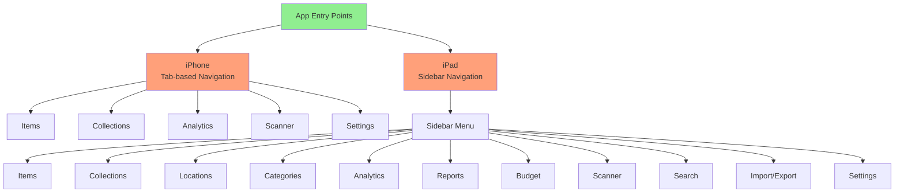
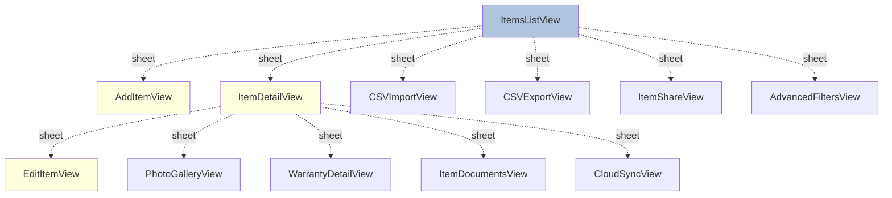
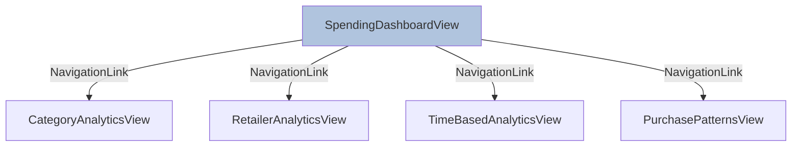
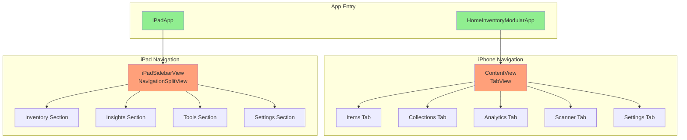

# Navigation Diagram - Modular Home Inventory

## Overview
This document contains Mermaid diagrams showing the navigation structure of the app. You can view these diagrams in any Markdown viewer that supports Mermaid (GitHub, VS Code with Mermaid extension, etc.).

## Simplified Navigation Overview

## Detailed Items Module Navigation

## Settings Module Navigation (All Sheets)

```mermaid
graph TD
    Settings[SettingsView]
    
    Settings -.->|sheet| Notif[NotificationSettingsView]
    Settings -.->|sheet| Spot[SpotlightSettingsView]
    Settings -.->|sheet| Access[AccessibilitySettingsView]
    Settings -.->|sheet| ScanSet[ScannerSettingsView]
    Settings -.->|sheet| Bio[BiometricSettingsView]
    Settings -.->|sheet| Privacy[PrivacyPolicyView]
    Settings -.->|sheet| Terms[TermsOfServiceView]
    Settings -.->|sheet| Export[ExportDataView]
    Settings -.->|sheet| Cache[ClearCacheView]
    Settings -.->|sheet| Crash[CrashReportingSettingsView]
    Settings -.->|sheet| SyncStat[SyncStatusView]
    Settings -.->|sheet| Conflicts[ConflictResolutionView]
    Settings -.->|sheet| Offline[OfflineDataView]
    Settings -.->|sheet| Rate[RateAppView]
    Settings -.->|sheet| ShareApp[ShareAppView]
    
    style Settings fill:#B0C4DE
```

## Analytics Module Navigation

## Complete Navigation Flow

## Navigation Types Legend

- **Solid Arrow (→)**: NavigationLink (push navigation)
- **Dashed Arrow (-.->)**: Sheet presentation (modal)
- **Tab Container**: TabView navigation
- **Sidebar**: NavigationSplitView (iPad)

## Key Navigation Patterns

1. **iPhone**: Uses TabView with 5 main tabs, each containing NavigationView
2. **iPad**: Uses NavigationSplitView with sidebar sections
3. **Modal Sheets**: Used extensively for forms, settings, and detail views
4. **NavigationLinks**: Used for hierarchical navigation within modules
5. **Programmatic Navigation**: Handled via view models and callbacks